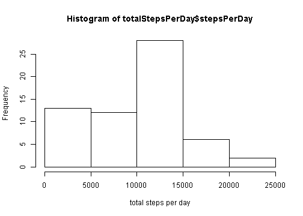
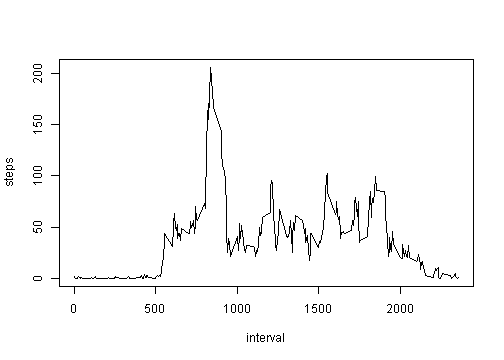
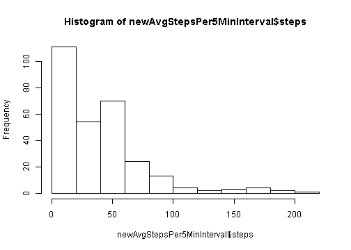
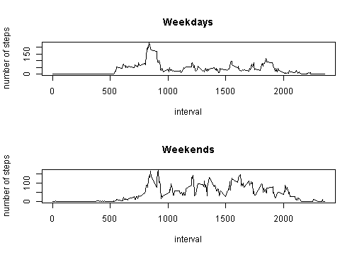

# Reproducable Research Week 2 Project
# tribs 


### >>> Loading and preprocessing the data <<<


```r
	##Show any code that is needed to

	##    Load the data (i.e. read.csv())
	##    Process/transform the data (if necessary) into a format suitable for your analysis
	
	## read the activity file
	
	read.table("activity.csv", sep=",", header=T, na.strings="NA") -> act
	
	# 1, Calculate the total number of steps taken per day
	
	totalStepsPerDay <- summarise(group_by(act,date),stepsPerDay=sum(steps, na.rm=T))
	
	# 2, If you do not understand the difference between a histogram and a barplot, research the difference between them. 
	#    Make a histogram of the total number of steps taken each day
	
	hist(totalStepsPerDay$stepsPerDay, xlab="total steps per day")
```



```r
	# 3, Calculate and report the mean and median of the total number of steps taken per day
	
	means <- summary(totalStepsPerDay$stepsPerDay) 
	
	# Min. 1st Qu.  Median    Mean 3rd Qu.    Max. 
	#      0    6778   10400    9354   12810   21190 
	
	Mean <- means["Mean"]
	Median <- means["Median"]
	
	
	# Make a time series plot (i.e. type = "l") of the 5-minute interval (x-axis) and the average number of steps taken, averaged across all days (y-axis)


	avgStepsPer5MinInterval <- aggregate(steps ~ interval,act, mean)
	avgStepsPer5MinInterval$steps <- round(avgStepsPer5MinInterval$steps)
	
	
	plot(avgStepsPer5MinInterval,type="l")
```



```r
	# Which 5-minute interval, on average across all the days in the dataset, contains the maximum number of steps?
	
	maxSteps <- which.max(avgStepsPer5MinInterval$steps)
	
	whichIntervalHasMaxSteps <- avgStepsPer5MinInterval[avgStepsPer5MinInterval$steps == maxSteps,]
```
#### The interval that has the maximum steps 920, is 104.
###


### >>> Imputing missing values <<<


```r
	# 1, Calculate and report the total number of missing values in the dataset (i.e. the total number of rows with NAs)
	
	cc <- complete.cases(act)
	rCount <- nrow(act[!cc,])
```

#### The number rows with missing values is : 2304	

```r
	## can also use sum(!complete.cases(act))
	
	
	# 2, Devise a strategy for filling in all of the missing values in the dataset. The strategy does not need to be sophisticated. For example, you could use the mean/median for that day, or the mean for that 5-minute interval, etc.
	
	## na.omit(act) --- skips incomplete rows
	
	## filter the records with nulls
	act[!cc,] -> nulls
	act[cc,] -> notNulls
	
	
	meanForTheDay <- aggregate(steps ~ interval,notNulls, mean)
	
	for (i in 1:nrow(meanForTheDay) ) {
		mIntrvl <- meanForTheDay[i,"interval"]
		mSteps <- round(meanForTheDay[i,"steps"])
	
		#print((mIntrvl))
		#print(mSteps)
	
		nulls[ as.character(nulls$interval) == mIntrvl, "steps" ] = mSteps 
	}
	
	# 3, Create a new dataset that is equal to the original dataset but with the missing data filled in.
	# create a new dataset merging the nulls and not-null DF's.
	
	newAct <- rbind(notNulls,nulls) 
	
	
	# 4, Make a histogram of the total number of steps taken each day and Calculate and report the mean and median total number of steps taken per day. Do these values differ from the estimates from the first part of the assignment? What is the impact of imputing missing data on the estimates of the total daily number of steps?
	
	newTotalStepsPerDay <- summarise(group_by(newAct,date),stepsPerDay=sum(steps, na.rm=T))
	newMeans <- summary(newTotalStepsPerDay$stepsPerDay) 
	
	newMean <- newMeans["Mean"]
	newMedian <- newMeans["Median"]
	
	## change in Mean and Median after adding the missing values
	meanDiff <- newMean - Mean
	medianDiff <- newMedian - Median
	
	newAvgStepsPer5MinInterval <- aggregate(steps ~ interval,newAct, mean)
	newAvgStepsPer5MinInterval$steps <- round(newAvgStepsPer5MinInterval$steps)
	
	hist(newAvgStepsPer5MinInterval$steps,type="l")
```

```
## Warning in plot.window(xlim, ylim, "", ...): graphical parameter "type" is
## obsolete
```

```
## Warning in title(main = main, sub = sub, xlab = xlab, ylab = ylab, ...):
## graphical parameter "type" is obsolete
```

```
## Warning in axis(1, ...): graphical parameter "type" is obsolete
```

```
## Warning in axis(2, ...): graphical parameter "type" is obsolete
```



####After imputing missing values the Mean increases by 1416 and Median increases by 360
####

### >>>Are there differences in activity patterns between weekdays and weekends? <<<


```r
	newAct$day <- weekdays(as.Date(as.character(newAct$date),"%Y-%m-%d"))
	newAct$weekDay <- as.factor(ifelse ( newAct$day %in% c("Monday","Tuesday", "Wednesday","Thursday","Friday"), "weekdays", "weekends" ))
	
	weekDays <- newAct[newAct$weekDay =="weekdays",c("interval","steps")]
	weekEnds <- newAct[newAct$weekDay =="weekends",c("interval","steps")]
	
	wd <- aggregate(steps ~ interval,weekDays,mean)
	we <- aggregate(steps ~ interval,weekEnds,mean)
	
	par(mfrow = c (2,1))
	
	plot(wd,type="l" , ylab="number of steps", main="Weekdays")
	plot(we,type="l" , ylab="number of steps", main="Weekends")
```



```r
	## could also use
	## xyplot(steps ~ interval | weekDay, groups = c(interval), newAct, type = "l", layout = c(1,2), xlab = "Interval", ylab = "Number of Steps", main = "Steps Distribution")
```

### >>> End <<<
